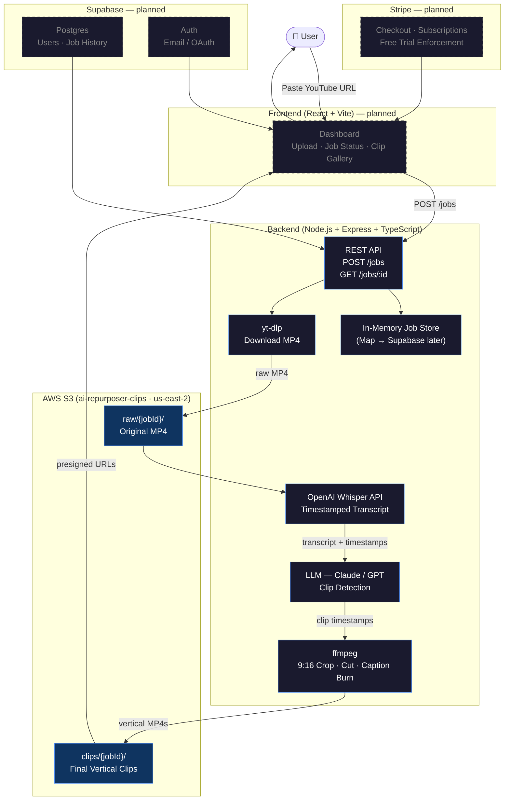

# AI Content Repurposer

Paste a YouTube link, get back captioned vertical clips ready to post on TikTok, Reels, and Shorts.

The tool downloads the video, transcribes it, asks an LLM to find the most engaging moments, cuts them into 15–60 second clips, burns in captions, and delivers them through a simple web dashboard.

---

## Architecture



---

## How It Works

1. **Paste a YouTube URL** — the backend pulls the video via yt-dlp.
2. **Transcription** — OpenAI Whisper generates a timestamped transcript.
3. **AI Clip Detection** — the transcript is sent to an LLM with a prompt to identify the most engaging moments.
4. **FFmpeg Engine** — clips are cut to the identified timestamps, cropped to 9:16, and captions are burned in (white text, black stroke).
5. **Dashboard** — a React frontend shows a processing state and a clip preview gallery where you can watch and download the final MP4s.

---

## Tech Stack

| Layer | Choice |
|---|---|
| Backend | Node.js |
| Video download | yt-dlp |
| Transcription | OpenAI Whisper API |
| Clip detection | LLM (prompt-based) |
| Video processing | FFmpeg |
| Frontend | React |
| Storage | AWS S3 |
| Payments | Stripe |
| Deployment | Vercel (frontend) + backend server |

---

## Features

- YouTube link → vertical clips, fully automated
- Timestamped transcript-based clip cutting
- 9:16 crop for mobile platforms
- Burned-in subtitles (no separate caption file needed)
- Clip preview gallery with one-click download
- Monthly subscription via Stripe
- Free trial: 1–2 videos before payment required

---

## Project Structure

```
/
├── backend/          # Node.js server, FFmpeg pipeline, Whisper + LLM integration
├── frontend/         # React dashboard (upload, processing state, clip gallery)
└── README.md
```

---

## Build Plan

| Chunk | Hours | Scope |
|---|---|---|
| Infrastructure & Upload | 4 | Node.js backend, S3 bucket, yt-dlp video pull |
| Transcription & Logic | 3 | Whisper integration, LLM clip detection |
| FFmpeg Engine | 4 | Timestamp-based cutting, 9:16 crop |
| Burn-in Captions | 3 | FFmpeg subtitle burn, basic white/black styling |
| Dashboard | 4 | React upload UI, processing state, clip gallery |
| Stripe Integration | 2 | Checkout, subscription, free trial enforcement |
| Deployment | 3 | Vercel deploy, end-to-end test |

**Total: ~23 hours**

---

## Getting Started

> Setup instructions will be added as the project is built out.

### Prerequisites

- Node.js 18+
- FFmpeg installed locally
- AWS account (S3)
- OpenAI API key
- Stripe account

### Environment Variables

```
OPENAI_API_KEY=
AWS_ACCESS_KEY_ID=
AWS_SECRET_ACCESS_KEY=
AWS_S3_BUCKET=
STRIPE_SECRET_KEY=
STRIPE_WEBHOOK_SECRET=
```

---

## License

Private.
