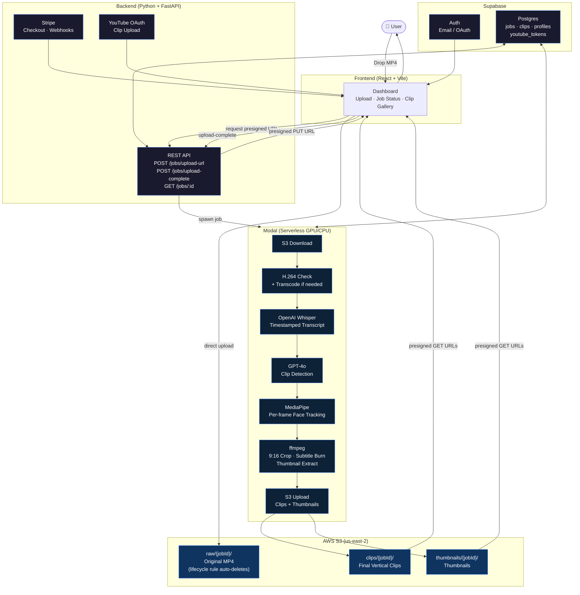

# HorizonClips

Upload an MP4, get back face-tracked 9:16 vertical clips with burned-in captions — ready to post on TikTok, Reels, and Shorts.

The pipeline downloads (or accepts a direct upload), transcribes with Whisper, asks GPT to find the most engaging moments, runs face tracking on every frame, crops to 9:16, burns in captions, and delivers clips through a web dashboard where you can preview, download, or push straight to YouTube Shorts.

---

## Architecture


```mermaid
flowchart TD
    User(["👤 User"])

    subgraph Frontend ["Frontend (React + Vite)"]
        UI["Dashboard\nUpload · Job Status · Clip Gallery"]
    end

    subgraph Backend ["Backend (Python + FastAPI)"]
        API["REST API\nPOST /jobs/upload-url\nPOST /jobs/upload-complete\nGET /jobs/:id"]
        StripeAPI["Stripe\nCheckout · Webhooks"]
        YouTubeAPI["YouTube OAuth\nClip Upload"]
    end

    subgraph Supabase ["Supabase"]
        SupaAuth["Auth\nEmail / OAuth"]
        DB["Postgres\njobs · clips · profiles\nyoutube_tokens"]
    end

    subgraph S3 ["AWS S3 (us-east-2)"]
        RawBucket["raw/{jobId}/\nOriginal MP4\n(lifecycle rule auto-deletes)"]
        ClipsBucket["clips/{jobId}/\nFinal Vertical Clips"]
        ThumbBucket["thumbnails/{jobId}/\nThumbnails"]
    end

    subgraph Modal ["Modal (Serverless GPU/CPU)"]
        Download["S3 Download"]
        H264["H.264 Check\n+ Transcode if needed"]
        Whisper["OpenAI Whisper\nTimestamped Transcript"]
        GPT["GPT-4o\nClip Detection"]
        MediaPipe["MediaPipe\nPer-frame Face Tracking"]
        FFmpeg["ffmpeg\n9:16 Crop · Subtitle Burn\nThumbnail Extract"]
        Upload["S3 Upload\nClips + Thumbnails"]
    end

    User -->|"Drop MP4"| UI
    UI -->|"request presigned URL"| API
    API -->|"presigned PUT URL"| UI
    UI -->|"direct upload"| RawBucket
    UI -->|"upload-complete"| API
    API -->|"spawn job"| Modal

    Download --> H264
    H264 --> Whisper
    Whisper --> GPT
    GPT --> MediaPipe
    MediaPipe --> FFmpeg
    FFmpeg --> Upload
    Upload --> ClipsBucket
    Upload --> ThumbBucket

    ClipsBucket -->|"presigned GET URLs"| UI
    ThumbBucket -->|"presigned GET URLs"| UI
    UI --> User

    SupaAuth --> UI
    DB <--> API
    DB <--> Modal
    StripeAPI --> UI
    YouTubeAPI --> UI

    classDef built fill:#1a1a2e,stroke:#4f8ef7,color:#fff
    classDef storage fill:#0f3460,stroke:#4f8ef7,color:#fff
    classDef compute fill:#0d2137,stroke:#4f8ef7,color:#fff

    class API,StripeAPI,YouTubeAPI,SupaAuth,DB built
    class RawBucket,ClipsBucket,ThumbBucket storage
    class Download,H264,Whisper,GPT,MediaPipe,FFmpeg,Upload compute
```

---

## How It Works

1. **Upload** — drop an MP4; the frontend gets a presigned S3 URL and uploads directly. Credits are deducted (1 per minute of video) before the job starts.
2. **Transcription** — OpenAI Whisper generates a word-level timestamped transcript on Modal.
3. **Clip Detection** — GPT-4o uses tool-calling to identify the most engaging moments and return structured clip boundaries with virality scores.
4. **Face Tracking** — MediaPipe runs on every frame; per scene segment the median face center is used to set a static 9:16 crop (hard jump at cuts, no panning).
5. **Subtitle Burn** — ffmpeg burns the generated SRT onto the tracked video with `force_style`.
6. **Dashboard** — clips appear in the gallery as they finish. Download MP4s or push directly to YouTube Shorts via OAuth.

---

## Tech Stack

| Layer | Choice |
|---|---|
| Backend | Python + FastAPI + uvicorn |
| Compute | Modal (transcription, face tracking, clip processing) |
| Video processing | ffmpeg + OpenCV + MediaPipe |
| Transcription | OpenAI Whisper API |
| Clip detection | OpenAI GPT-4o (tool-calling) |
| Storage | AWS S3 (us-east-2) |
| Database | Supabase Postgres |
| Auth | Supabase Auth (JWT) |
| Payments | Stripe (subscriptions + credit top-ups) |
| Frontend | React + Vite + Tailwind |

---

## Features

- Direct MP4 upload → face-tracked vertical clips, fully automated
- MediaPipe face tracking — no static crop, follows the subject across scenes
- Burned-in captions (word-level timestamps from Whisper)
- Clip preview gallery with one-click MP4 download
- One-click upload to YouTube Shorts (OAuth, auto token refresh)
- Credit system — 1 credit per minute of video
- Stripe subscription + credit top-ups

---

## Project Structure

```
/
├── backend-python/       # FastAPI server, Modal runner, pipeline services
│   ├── main.py           # App entry point, route registration
│   ├── routes/           # jobs, clips, stripe, youtube-auth
│   ├── services/
│   │   ├── pipeline.py   # Orchestrates transcription → detection → processing
│   │   ├── autoframe.py  # Face-tracked 9:16 crop (MediaPipe + OpenCV)
│   │   ├── clipper.py    # ffmpeg subtitle burn
│   │   ├── clip_detector.py  # GPT tool-calling clip detection
│   │   └── modal_runner.py   # Modal entrypoint
│   └── middleware/       # Auth (Supabase JWT validation)
└── frontend/             # React dashboard
    └── src/
        ├── components/   # ClipCard, JobSection, Upload, etc.
        └── api.ts        # Typed API client
```

---

## Getting Started

### Prerequisites

- Python 3.11+
- ffmpeg
- AWS account (S3)
- OpenAI API key
- Supabase project
- Stripe account
- Modal account

### Environment Variables

Copy `backend-python/.env.sample` to `backend-python/.env`:

```
OPENAI_API_KEY=
AWS_REGION=us-east-2
AWS_ACCESS_KEY_ID=
AWS_SECRET_ACCESS_KEY=
AWS_S3_BUCKET=
STRIPE_SECRET_KEY=
STRIPE_WEBHOOK_SECRET=
STRIPE_PRO_PRICE_ID=
SUPABASE_URL=
SUPABASE_SERVICE_ROLE_KEY=
FRONTEND_URL=http://localhost:5173
FFMPEG_PATH=/opt/homebrew/bin/ffmpeg
GOOGLE_CLIENT_ID=
GOOGLE_CLIENT_SECRET=
GOOGLE_REDIRECT_URI=
```

Modal secrets are stored in Modal's secret manager under `ai-repurposer-secrets`.

### Running Locally

```bash
# Backend
cd backend-python
uvicorn main:app --reload --port 8000

# Frontend
cd frontend
npm install
npm run dev
```

### Deploy Modal Worker

```bash
cd backend-python
modal deploy services/modal_runner.py
```

Modal does **not** auto-deploy when the backend deploys — any changes to pipeline code require a manual `modal deploy`.

---

## License

Private.
